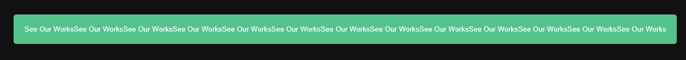

-   文字填充屬性

```
    -webkit-background-clip: text; //border-box:延伸至border padding-box:延伸至padding不超過border content-box:延伸到content不超過border(若沒設定padding content-box / padding-box; 會看不出差異)  text:限於文字區域的背景
    -webkit-text-fill-color: transparent; //文字填充: 透明
```

-   max-content : 寬度 = 內容 (CSS3)
    -   寬度隨內容伸展

```
  width: max-content;
```




-   filter 濾鏡 : 實現顏色偏移 & 模糊效果，常用於調整圖像、背景&邊框的渲染

```
/* URL to SVG filter */
filter: url("filters.svg#filter-id");

/* <filter-function> values */
filter: blur(5px);
filter: brightness(0.4);
filter: contrast(200%);
filter: drop-shadow(16px 16px 20px blue);
filter: grayscale(50%);
filter: hue-rotate(90deg);
filter: invert(75%);
filter: opacity(25%);
filter: saturate(30%);
filter: sepia(60%);

/* Multiple filters */
filter: contrast(175%) brightness(3%);

/* Use no filter */
filter: none;

/* Global values */
filter: inherit;
filter: initial;
filter: revert;
filter: unset;

```

方法:

```
filter: <filter-function> [<filter-function>]* | none

- reference
  - https://developer.mozilla.org/zh-CN/docs/Web/CSS/filter
```
