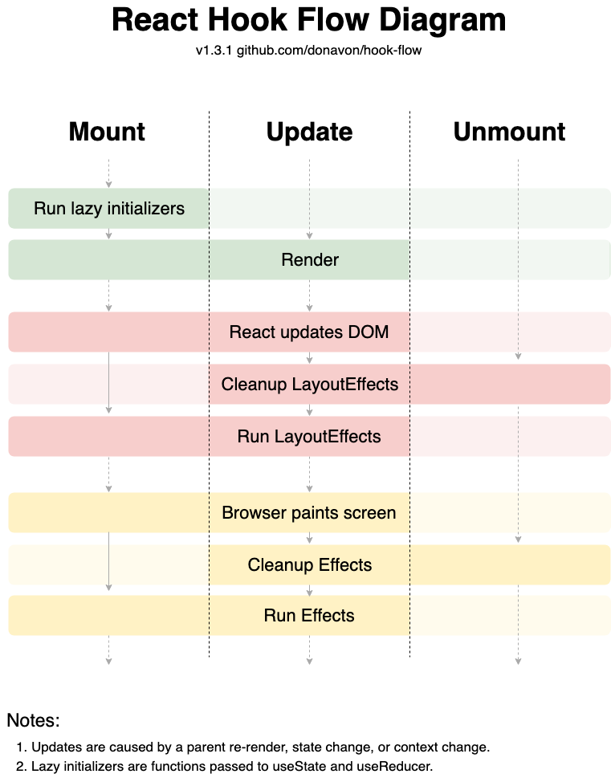

React的生命週期

- mounting > updating > unmounting
  - constructor > render > componentDidMount
  - static > getDerivedStateFromUpdate > shouldComponentUpdate > render > getSnapshotBeforeUpdate > componentDidUpdate
  - componentDidUpdate 
  ------
    - constructor : 初始化，還沒掛載到DOM的時候
    - render : 回傳JSX
    - componentDidMount : DOM已經掛載完成，在這階段**可以呼叫API**用於更新DOM，適合做一些初始化的工作。
    - componentWillUnmount : component從DOM被移除 ，在這階段可以用來清除一些計時器

class components & functional components的差異
    - **class component**
      - 透過 ES6 語法來實作物件導向的 class component
      - 由於 this 指向的關係，state 和 props 會拿到最新的結果，但是會較不易於進行 callback 操作
      - 提供許多 lifecycle method 使用，方便管理較複雜的 component 狀態
    
    - function component
      - 透過閉包的形式來管理狀態的 function component
      - 把許多 method 都寫在 function 中，自己本身就像是 render function，較容易抽出共同邏輯，或是進行模組化測試
      - 生命週期的方法，是以 useEffect 來決定 render 要做的事情

Hooks如何模擬class component的生命週期
 - 透過useEffect執行生命週期
 - 

React有哪些 hook
  - useState
  - useEffect
  - useContext
  - useReducer
  - useCallback
  - useMemo
  - custom Hook

Array的高階函數有哪些
    - map
    - forEach
    - filter
    - reducer
    - sort

local storage & cookies的差異 *
    - cookie在沒有特別設定的情況下會被刪除
    - local storage 在沒有手動刪除之前會一直存在

是否接觸過雲端產品
  - AWS

branch & rebase的差異 *
- branch 建立新的分支
- rebase 將目前的版本做為新的起始點